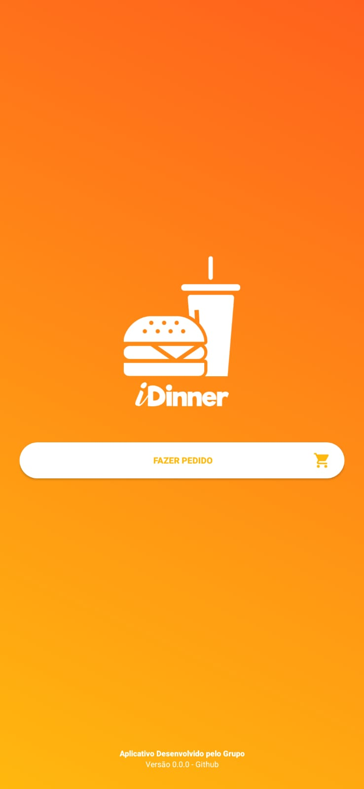
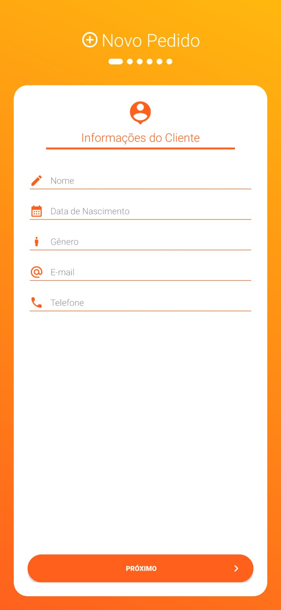
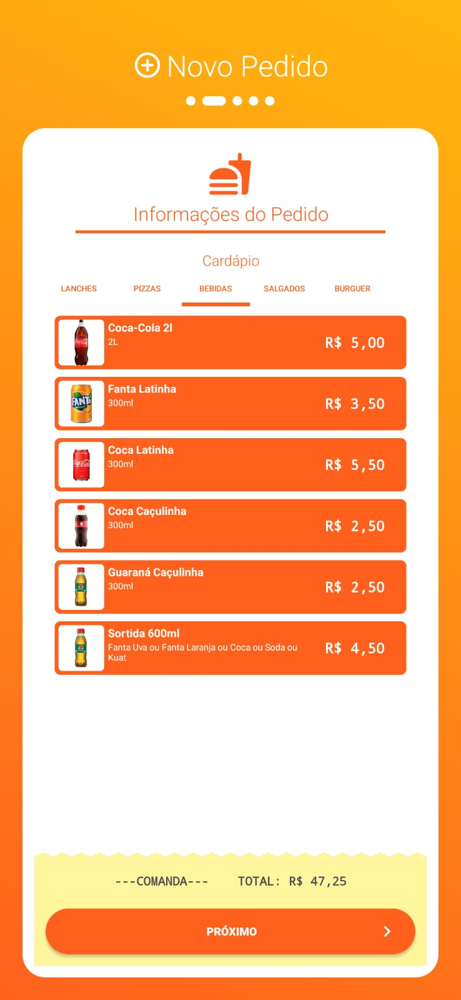
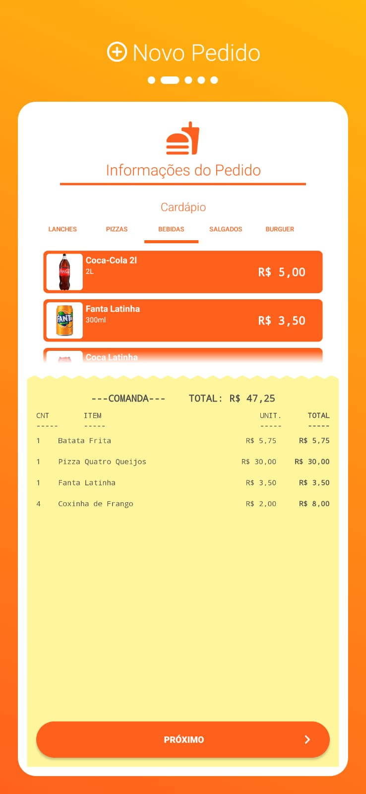
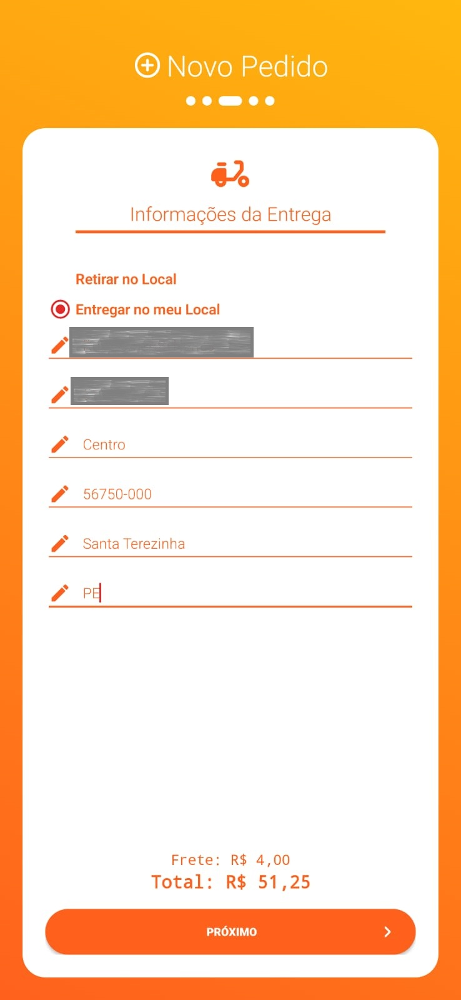
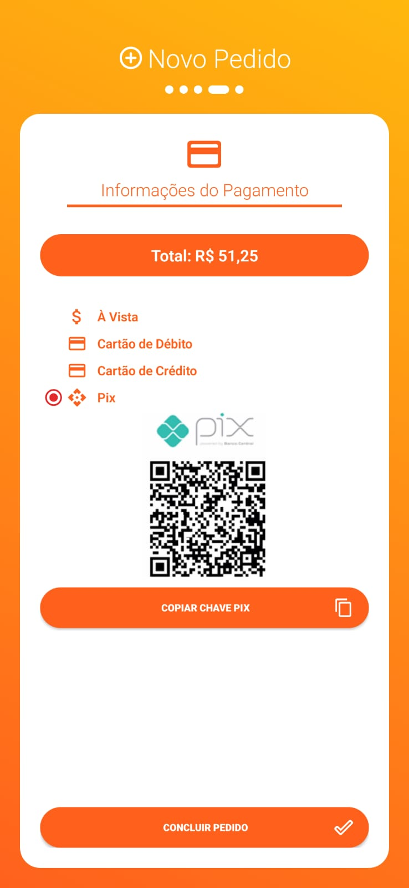
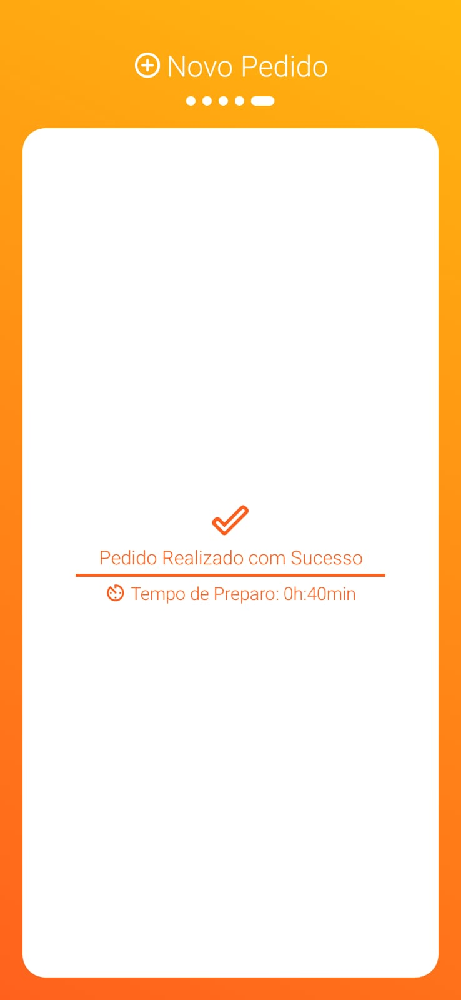

# iDinner

### Desenvolvedores: 
- JOSÉ FIRMINO VERAS NETO
- PEDRO JOSÉ VIANA DE LIMA GUEDES
- IVANICE FRAGOSO MARTINS CUNHA 
- PEDRO AFONSO LEITE DE ANDRADE 
### 25 de março de 2022

# 1. Descrição do sistema
O iDinner é um projeto que permite ao cliente de um restaurante específico fazer o seu
pedido diretamente pelo seu dispositivo móvel, não exigindo que o cliente espere algum
atendente do estabelecimento, melhorando a experiência do consumidor e evitando
sobrecarregar os trabalhadores do local. O cliente, ao chegar no estabelecimento, abre o
aplicativo do iDinner, confere as opções do cardápio e os preços direto pelo app, seleciona
quais forem de sua preferência e após isso, o aplicativo revisa as formas de entrega e pagamento.

# 2. Requisitos do sistema
O iDinner foi desenvolvido para celulares com Android 5.1 (Lollipop) ou superior. Há também a versão desktop em console.

# 3. Finalidade do projeto
O iDinenr é um projeto destinado à disciplina de Linguagens de Programação II, ofertada pela Universidade Estadual da Paraíba, desenvolvido pelos estudantes ora citados
, utilizando os conhecimentos adquiridos durante as auals do Prof. Leandro de Almeida Melo. O iDinner foi idealziado e desenvolvido pela equipe no periodo de 04 à 25 de março de 2022.

# 4. Como baixar o aplicativo?
O iDinner é disponibilizado gratuitamente através da aba ```Releases``` da plataforma GitHub, o usuário poderá baixar o apk e instalar nos celulares compatíveis ou
[clique aqui para baixar](https://github.com/firminoveras/iDinner/releases/download/Alfa/iDinner.apk).

# 5. Nota de desenvolvimento
O iDinner é um **projeto base**, ou seja, não está implementado para funcionar integralmente em restaurantes, é uma versão experimental com o propósito acadêmico.

# 6. Telas e Funcionalidades

## Tela de Splash

Tela inicial onde o usuário pode ver a versão do aplicativo e iniciar o pedido seguido da animação de entrada.

## Tela de Novo Pedido

Aqui o usuário digitará suas informações pessoais para o processamento correto do pedido, esses dados serão salvos para que o usuário não precise sempre digita-los ao realizar um novo pedido.

## Tela de Cardápio


Nesta tela é possível que o usuário acesse o cardápio e realize os pedidos dos ítens que deseja comprar, ao final da tela haverá uam comanda, onde o usuário poderá modificar e acompanhar detalhes dos ítens do seu pedido.

## Tela de Entrega

Aqui, o usuário poderá escolher qual modalidade de entrega, podendo ir buscar pessoalmente o pedido na lanchonete ou digitar o endereço de entrega, consultando também o valor da entrega.

## Tela de Pagamento

Por último, o usuário devera escolher a forma de pagamento entre as permitidas atualmente pelo aplicativo, aqui, por motivos de segurança, o aplicativo não guardará informações sobre os cartões.

## Tela de Conclusão


# Licença
MIT License

Copyright (c) 2022 José Firmino Veras Neto

Permission is hereby granted, free of charge, to any person obtaining a copy
of this software and associated documentation files (the "Software"), to deal
in the Software without restriction, including without limitation the rights
to use, copy, modify, merge, publish, distribute, sublicense, and/or sell
copies of the Software, and to permit persons to whom the Software is
furnished to do so, subject to the following conditions:

The above copyright notice and this permission notice shall be included in all
copies or substantial portions of the Software.

THE SOFTWARE IS PROVIDED "AS IS", WITHOUT WARRANTY OF ANY KIND, EXPRESS OR
IMPLIED, INCLUDING BUT NOT LIMITED TO THE WARRANTIES OF MERCHANTABILITY,
FITNESS FOR A PARTICULAR PURPOSE AND NONINFRINGEMENT. IN NO EVENT SHALL THE
AUTHORS OR COPYRIGHT HOLDERS BE LIABLE FOR ANY CLAIM, DAMAGES OR OTHER
LIABILITY, WHETHER IN AN ACTION OF CONTRACT, TORT OR OTHERWISE, ARISING FROM,
OUT OF OR IN CONNECTION WITH THE SOFTWARE OR THE USE OR OTHER DEALINGS IN THE
SOFTWARE.
